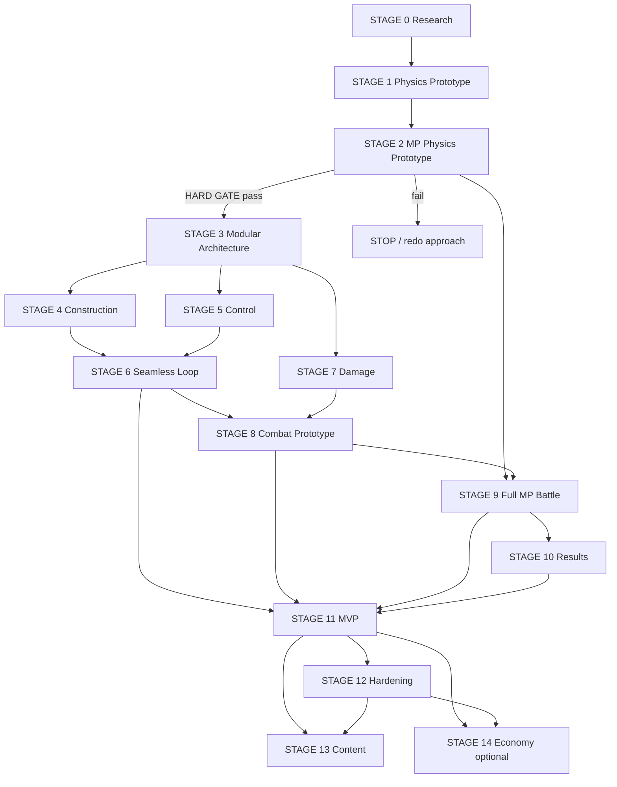

# Technical Roadmap — ra2-analog

**Назначение:** последовательность **технических доказательств**, а не список «фич для заполнения спринта».  
**Принцип:** сначала самые опасные гипотезы → затем production architecture → затем контент и polish.

**Связанные документы:** [GDD](GDD.md) · [TECHNICAL_ROADMAP](TECHNICAL_ROADMAP.md) · [TECHNICAL_PRINCIPLES](TECHNICAL_PRINCIPLES.md) · [UNITY_ENGINE](UNITY_ENGINE.md) · [SDS](SDS.md)

**Production engine:** Unity (зафиксирован). Смена движка вне roadmap.

Сроки в неделях/месяцах **не указываются** — нет зафиксированного размера команды. Порядок и gates важнее календаря.

---

## Как читать roadmap

1. Каждый STAGE — доказательство или сборка на уже доказанном.  
2. **Decision Gate** обязателен: Success / Redo / Change Approach.  
3. **STAGE 2 — hard stop:** если physics + multiplayer неудовлетворительны, дальнейшая разработка **останавливается** до решения.  
4. Эксперименты `EXP-01…09` из [UNITY_ENGINE.md](UNITY_ENGINE.md) встраиваются в стадии (см. mapping ниже).

### Mapping экспериментов → стадии

| Experiment | Primary stage |
|------------|---------------|
| U-VER | 0 |
| EXP-01 runtime build (thin) | 1 → углубление в 3 |
| EXP-02 bodies/joints stress | 1 |
| EXP-03 two-robot interaction (local) | 1 |
| EXP-05…08 net physics/input/latency | 2 |
| EXP-09 dedicated server | 2 (smoke) → 9 (hardening) |
| U-SER serialization | 3 |
| U-SCN seamless scenes | 6 |
| EXP-04 damage/detach | 7 (thin probes допустимы раньше) |

---

## Multiplayer-aware vs local-first

### Делать multiplayer-aware с первого дня (схема данных / контракты)

Даже если реализация сначала локальная / listen-server:

| Система | Почему |
|---------|--------|
| Robot blueprint / identity | Должен уезжать в матч без переписывания |
| Component type IDs + instance state | Sync урона и наличия частей |
| Connection / joint descriptors | Detach и net должны говорить на одном языке |
| Control actions как команды (не «напрямую крутить локальный joint в UI-коде») | Input sync на STAGE 2/5/9 |
| Match/session phase model | Lobby → fight → results |
| Authority boundary (что клиент может / не может) | Anti-cheat и server sim |
| Event log урона/исхода (минимальный) | Results + будущий replay |

### Можно делать локально и адаптировать позже

| Система | Условие |
|---------|---------|
| Visual polish редактора, gizmos | Не протекать в authoritative state |
| Test Room UX chrome | Пока не ломает shared robot runtime |
| VFX/SFX, камеры | Клиентские |
| Arena art | После combat rules |
| Matchmaking UX | После session abstraction |
| Career / economy / cosmetics | Только после доказанного core PvP |
| Онбординг-туториалы | После стабильного loop |

### Запрещённый паттерн

«Полностью одиночный симулятор с уникальной моделью робота → потом прикрутим сеть» без сохранения контрактов выше.

---

## Dependency graph



**Параллелизм (после GATE STAGE 2):** STAGE 4 и STAGE 5 могут идти параллельно на базе STAGE 3. STAGE 7 может начинаться thin-slice параллельно с 4–6, но freeze damage model — до STAGE 8.

---

## Critical Path

```
0 Research
→ 1 Local physics proof
→ 2 Multiplayer physics proof  ★ HARD GATE
→ 3 Modular robot architecture
→ (4 Construction ∥ 5 Control)
→ 6 Seamless Design↔Configure↔Test
→ (7 Damage →) 8 Combat prototype
→ 9 Full multiplayer battle
→ 10 Results foundations
→ 11 MVP integration
→ 12 Production hardening
→ 13 Content / 14 Economy (optional, after PvP proven)
```

Всё, что не на critical path (лишние арены, косметика, экономика, большой каталог), **не** опережает STAGE 2–3.

---

# STAGE 0 — Pre-production / Technical Research

### 1. Цель этапа
Сформулировать требования и **кандидатные** решения *внутри Unity*; подготовить architecture spike-план. Движок уже выбран (Unity).

### 2. Почему этот этап существует
Без явных гипотез и метрик команда начнёт «писать системы» на неподтверждённом physics/net стеке.

### 3. Что должно быть известно ДО начала
- GDD / Vision / Technical Principles / UNITY_ENGINE.  
- Workspace baseline: `UnityProject/ra2-analog/` (Unity 6000.5.9f1).

### 4. Что необходимо разработать
- Матрица требований → candidates (physics, netcode, dedicated server, serialization, scenes).  
- План spikes EXP/U-* с метриками.  
- Минимальный architecture sketch (authority, robot blueprint, scenes).  
- Decision log template.

### 5. Какие технические гипотезы проверяем
- Baseline Unity версия пригодна для spike (U-VER smoke).  
- Есть ≥1 правдоподобный physics candidate и ≥1 net candidate под требования GDD.  
- Dedicated Server build target достижим на baseline.

### 6. Multiplayer requirements
- Зафиксировать **server-authoritative battle** как целевую модель (listen-server только как временный debug).  
- Перечислить данные, которые обязаны быть serializable для матча.

### 7. Что НЕ делаем
- Выбор Unreal/других движков.  
- Production systems, UI редактора, контент, экономика.  
- Финальный freeze packages без последующих STAGE 1–2.

### 8. Deliverables
- Обновлённый decision log (candidates).  
- Spike backlog с acceptance metrics.  
- Краткая architecture sketch (1–3 стр.).

### 9. Acceptance Criteria
- Кандидаты и риски записаны; open items помечены `[EXPERIMENT REQUIRED]`.  
- Есть явный план STAGE 1–2.

### 10. Performance Criteria
- N/A (кроме smoke: проект открывается, player/server build не блокируется).

### 11. Networking Criteria
- Кандидаты netcode перечислены; критерии сравнения согласованы с EXP-05…09.

### 12. Known Risks
- Ложный freeze «дефолтного» PhysX/NGO без метрик.  
- Scope creep research.

### 13. Exit Criteria
- Команда может начать STAGE 1 без спора «на чём вообще пишем spike».

### 14. Decision Gate
| Success | Redo | Change approach |
|---------|------|-----------------|
| Candidates + metrics ready; U-VER smoke pass | Неясны требования/метрики | Baseline Unity version/tooling show-stopper → смена pin/версии Unity (не смена engine) |

### 15. Что открывает следующий этап
Разрешение строить **локальный** physics prototype на выбранном для spike physics path.

---

# STAGE 1 — Physics Prototype

### 1. Цель этапа
Доказать **базовую физическую модель** минимального робота: chassis, rigidbodies, wheels, motors, collisions, basic joints.

### 2. Почему этот этап существует
Если локальная физика модульной машины нечитаема/нестабильна, сеть только усилит боль.

### 3. Что должно быть известно ДО начала
- Exit STAGE 0.  
- Physics candidate для первого spike (может быть provisional).

### 4. Что необходимо разработать
- Минимальный робот (ручная или semi-data сборка).  
- Движение колёс/моторов, столкновения, базовые joints.  
- Простой local test bed (не полный Test Room UX).  
- Профилирование bodies/joints (EXP-02).  
- Локальный two-robot contact smoke (EXP-03 thin).

### 5. Какие технические гипотезы проверяем
- PhysX (или alt candidate) даёт стабильный drive + collision.  
- Joints не взрывают симуляцию на типичной сборке.  
- Два робота локально взаимодействуют читаемо.  
- Есть черновой performance budget на 1 машину.

### 6. Multiplayer requirements
- Не строить net ещё, но:  
  - не зашивать управление только в mono-behavior без будущего command layer;  
  - именовать части стабильными IDs;  
  - зафиксировать, что authoritative pose будет server-side later.

### 7. Что НЕ делаем
- Netcode, lobby, редактор конструкции, damage polish, weapons meta, экономика.

### 8. Deliverables
- Playable local physics demo.  
- Отчёт EXP-01 (thin) / EXP-02 / EXP-03 (local).  
- Provisional physics budget numbers.

### 9. Acceptance Criteria
- Робот едет, тормозит, врезается предсказуемо.  
- Playtester может объяснить поведение.  
- Нет систематического simulation explosion на demo-сборке.

### 10. Performance Criteria
- Physics step укладывается в выбранный fixed timestep на target ref hardware для demo complexity.  
- Зафиксирован верхний «жёлтый» порог bodies/joints до STAGE 2.

### 11. Networking Criteria
- N/A (подготовка контрактов только).

### 12. Known Risks
- Wheel collider vs custom raycast tradeoffs.  
- Joint tuning hell.  
- Слишком сложный «минимальный» робот.

### 13. Exit Criteria
- Локальная физика признана достаточной базой для сетевого spike.

### 14. Decision Gate
| Success | Redo | Change approach |
|---------|------|-----------------|
| Стабильный drive+collision+joints в budget | Упростить робота / перенастроить joints/solver | Сменить physics stack candidate внутри Unity и повторить STAGE 1 |

### 15. Что открывает следующий этап
**STAGE 2** — multiplayer physics prototype на той же физической модели.

---

# STAGE 2 — Multiplayer Physics Prototype ★ CRITICAL

### 1. Цель этапа
Два **реальных клиента**, два робота: movement, collisions, basic combat interaction, network sync. Доказать, что **physics + multiplayer** жизнеспособны.

### 2. Почему этот этап существует
Главный технический риск проекта. Месяцы контента/редактора бессмысленны, если 1v1 physics online не работает.

### 3. Что должно быть известно ДО начала
- Exit STAGE 1.  
- Netcode candidate для spike.  
- Provisional authority model (server authoritative).

### 4. Что необходимо разработать
- Минимальный net host/client (или client + dedicated).  
- Sync движения и столкновений двух роботов.  
- Базовое взаимодействие «урон/импульс/вывод из строя» (очень thin).  
- Input → server commands.  
- Latency simulation harness.  
- Early dedicated server smoke (EXP-09 thin).

### 5. Какие технические гипотезы проверяем
- EXP-05 sync physics.  
- EXP-06 server authority.  
- EXP-07 input sync.  
- EXP-08 latency/interpolation/prediction need.  
- Playable feel на целевом RTT.

### 6. Multiplayer requirements
- Обязательны: 2 clients, authoritative sim, согласованный исход столкновений/thin combat.  
- Зафиксировать transport/netcode provisional choice по результатам.  
- Disconnect = хотя бы deterministic fail (не silent desync).

### 7. Что НЕ делаем
- Полный редактор, groups/composite UI, карьера, matchmaking production, большой damage model, polish.

### 8. Deliverables
- Online 1v1 physics demo.  
- Отчёты EXP-05…08 (+ EXP-09 smoke).  
- Written go/no-go recommendation.

### 9. Acceptance Criteria
- Оба клиента согласны в исходе demo-столкновения/thin fight.  
- Читерский клиентский impulse не выигрывает у server (smoke).  
- Управление узнаваемо при оговорённом RTT.

### 10. Performance Criteria
- Server tick стабилен для 1v1 demo complexity.  
- Client frame не обязан быть production-ready, но hitch от net не делает demo unplayable.

### 11. Networking Criteria
- Positional/visual error в согласованных пределах на target RTT.  
- Нет регулярного hard desync.  
- Input loss ниже порога, зафиксированного в отчёте.

### 12. Known Risks
- PhysX + net плохо сходятся.  
- Prediction для модульных joints слишком дорог.  
- Dedicated server CPU уже не тянет 1v1.

### 13. Exit Criteria
- **GO** для modular architecture — или официальный **STOP**.

### 14. Decision Gate ★ HARD STOP
| Success | Redo | Change approach |
|---------|------|-----------------|
| Playable authoritative 1v1 physics; метрики в отчёте зелёные | Упростить sync surface (меньше bodies synced, coarser proxy) и повторить | Сменить netcode stack / authority strategy / physics representation for net (например proxy colliders, не полный joint graph на клиенте). **Не** идти в STAGE 3–14 как ни в чём не бывало |

**STOP rule:** при красном gate — запрещены Construction polish, Content, Economy, «пока сделаем редактор».

### 15. Что открывает следующий этап
Разрешение строить **modular production architecture** на проверенной net+physics модели.

---

# STAGE 3 — Modular Robot Architecture

### 1. Цель этапа
Component system, connections, runtime assembly, data-driven definitions, component lifecycle — совместимые с уже доказанным physics/net путём.

### 2. Почему этот этап существует
Нужен единый runtime, на котором будут Construction, Control, Damage и Battle, без ad-hoc demo-иерархий STAGE 1–2.

### 3. Что должно быть известно ДО начала
- GO из STAGE 2.  
- Какие сущности sync’ятся (full bodies vs proxies).

### 4. Что необходимо разработать
- Component definition data.  
- Instance lifecycle (create, enable, disable, detach, destroy).  
- Connection model.  
- Runtime assembly from blueprint (EXP-01 full).  
- Serialization round-trip (U-SER).  
- Shared spawn path для local test и net match.

### 5. Какие технические гипотезы проверяем
- Новый тип компонента добавляется данными без rewrite core.  
- Runtime assembly стабилен для net spawn.  
- Lifecycle события не ломают authority model.

### 6. Multiplayer requirements
- Blueprint + state diff/events проектируются как network payloads.  
- Server spawns authoritative robot from validated blueprint.  
- Client получает тот же logical graph.

### 7. Что НЕ делаем
- Полноценный UX редактора (только debug assembly).  
- Финальный каталог деталей.  
- Economy hooks.

### 8. Deliverables
- Modular runtime + sample definitions.  
- Blueprint schema v0.  
- Spawn-in-net demo на modular data (не hand-built only).

### 9. Acceptance Criteria
- Робот из данных собирается local и в net spike.  
- Добавление sample component = data + small adapter, без правок «всей игры».

### 10. Performance Criteria
- Assembly time не ломает match start / test spawn targets (пороги из отчёта).  
- Lifecycle events в budget tick.

### 11. Networking Criteria
- Spawn/despawn согласованы.  
- Schema versioning strategy черновая есть.

### 12. Known Risks
- Слишком абстрактный framework.  
- Схема не совпадает с sync model STAGE 2.

### 13. Exit Criteria
- Construction и Control могут строиться на одном runtime.

### 14. Decision Gate
| Success | Redo | Change approach |
|---------|------|-----------------|
| Data-driven spawn local+net stable | Сузить abstraction; меньше component kinds | Пересмотреть representation (например assembly на server-only + client visuals) |

### 15. Что открывает следующий этап
STAGE 4 и STAGE 5 (параллельно).

---

# STAGE 4 — Construction Prototype

### 1. Цель этапа
Игрок (или дизайнер) собирает робота: корпус/границы, размещение, материалы (базовые), компоненты, соединения, ограничения; результат = valid blueprint.

### 2. Почему этот этап существует
Без construction нет Robot Arena fantasy; но он идёт **после** physics/net/modular proof.

### 3. Что должно быть известно ДО начала
- STAGE 3 runtime + schema.  
- Ограничения complexity из physics budget.

### 4. Что необходимо разработать
- Construction tools (prototype UX).  
- Validation (overlap, power budget thin, mass/CoM readout).  
- Save/load blueprint.  
- Enforce limits, совместимые с STAGE 1–2 budgets.

### 5. Какие технические гипотезы проверяем
- Свобода сборки не взрывает physics budgets.  
- Игрок понимает mass/CoM/power feedback.  
- Invalid builds отсекаются до боя.

### 6. Multiplayer requirements
- Blueprint validation одинакова client preview и server admit.  
- No «local-only legal» robots in match.

### 7. Что НЕ делаем
- Финальный art, огромный каталог, economy costs как баланс PvP.

### 8. Deliverables
- Construction prototype → blueprint → runtime robot.  
- Validator v0.

### 9. Acceptance Criteria
- Собрать ≥2 разных валидных робота и довести до test/battle spawn path.  
- CoM/mass видны и влияют на поведение ожидаемо.

### 10. Performance Criteria
- Editor interaction responsive на max-budget build.  
- Validation time приемлем для iteration.

### 11. Networking Criteria
- Server rejects tampered/invalid blueprints (smoke).

### 12. Known Risks
- Editor complexity explosion.  
- Players create joint nightmares.

### 13. Exit Criteria
- Construction output = first-class input to Control/Test/Battle.

### 14. Decision Gate
| Success | Redo | Change approach |
|---------|------|-----------------|
| Builds validate and play | Урезать editor freedom / stronger snaps | Сменить hull/placement paradigm (например grid-only MVP) |

### 15. Что открывает следующий этап
Полноценный Control на player-built robots; вклад в STAGE 6.

---

# STAGE 5 — Control / Configuration System

### 1. Цель этапа
Actions, bindings, groups, composite actions, input — игрок программирует управление.

### 2. Почему этот этап существует
Ключевая фантазия GDD; должна стыковаться с command model сети.

### 3. Что должно быть известно ДО начала
- Component actions в data (STAGE 3).  
- Input command path из STAGE 2.

### 4. Что необходимо разработать
- Binding UI/prototype.  
- Groups + composite (танковый пример).  
- Conflict policy v0.  
- Persist control map in blueprint.  
- Digital input MVP; analog — если gate позволяет.

### 5. Какие технические гипотезы проверяем
- Composite groups выразительны для drive.  
- Control map serializes и исполняется identically on server.  
- Конфликты объяснимы.

### 6. Multiplayer requirements
- Bindings не исполняются «только локально мимо server».  
- Server applies actions from input commands.  
- Control map part of validated robot loadout.

### 7. Что НЕ делаем
- Визуальный scripting полного языка.  
- Поддержка всех устройств сразу.

### 8. Deliverables
- Configure prototype.  
- Spec conflict priority.  
- Net-executed control demo.

### 9. Acceptance Criteria
- WASD-style composite drive на group.  
- Оружие/мотор actions биндятся и работают в net/local test path.

### 10. Performance Criteria
- Input → command aggregation cheap per tick.

### 11. Networking Criteria
- Нет systematic lost composite edges under target loss/jitter (retest EXP-07).

### 12. Known Risks
- UX слишком сложный.  
- Детерминизм групп при partial damage later.

### 13. Exit Criteria
- Configure — обязательная часть iteration loop.

### 14. Decision Gate
| Success | Redo | Change approach |
|---------|------|-----------------|
| Groups+bindings usable in playtest | Упростить model (fewer composite rules) | Сменить input model (например presets-only MVP) |

### 15. Что открывает следующий этап
STAGE 6 seamless workflow.

---

# STAGE 6 — Seamless Design → Configure → Test Workflow

### 1. Цель этапа
Максимально короткий iteration loop Design ↔ Configure ↔ Test без долгих загрузок (U-SCN).

### 2. Почему этот этап существует
GDD pillar **Fast Iteration**. Медленный loop убивает engineering fantasy.

### 3. Что должно быть известно ДО начала
- Construction + Control prototypes.  
- Shared runtime spawn.

### 4. Что необходимо разработать
- App shell / additive scenes / mode switch.  
- In-memory robot retain across modes.  
- Test Room: spawn, reset, basic debug aids (action highlight, CoM).  
- Measure switch times.

### 5. Какие технические гипотезы проверяем
- Можно переключать режимы без full reload.  
- Physics world reset дешёвый и надёжный.  
- Iteration time достаточно мал для «гипотеза → проверка».

### 6. Multiplayer requirements
- Test Room может оставаться local.  
- Тот же blueprint, что пойдёт в MP battle.  
- Не создавать «test-only» robot format.

### 7. Что НЕ делаем
- Online test vs random opponents.  
- Polish tutorial.

### 8. Deliverables
- Seamless loop demo.  
- U-SCN report with timings.

### 9. Acceptance Criteria
- Playtest: правка → тест → правка без ощущения «загрузки уровня».  
- Reset возвращает к воспроизводимому состоянию.

### 10. Performance Criteria
- Switch/reset timings зафиксированы и приняты (целевые пороги — из замера, не из фантазии).  
- Нет длительных hitches на типичной сборке.

### 11. Networking Criteria
- N/A для Test Room; readiness checklist «blueprint MP-valid» optional gate.

### 12. Known Risks
- Hidden loads (shader/phys bake).  
- State leaks between modes.

### 13. Exit Criteria
- Loop считается продуктово приемлемым для MVP path.

### 14. Decision Gate
| Success | Redo | Change approach |
|---------|------|-----------------|
| Measured seamless loop accepted | Optimize scene graph / pooling | Сменить scene architecture (single-world modes vs additive) |

### 15. Что открывает следующий этап
Combat prototype на роботах из настоящего loop; MVP integration становится реалистичным.

---

# STAGE 7 — Damage / Destruction

### 1. Цель этапа
Damage model: component damage, functional failure, detachment (по мере готовности), destruction consequences.

### 2. Почему этот этап существует
Бой без отказов частей превращается в «полоски HP». Но полный detach раньше net-proof опасен — поэтому после STAGE 2–3 и до/к STAGE 8.

### 3. Что должно быть известно ДО начала
- Component lifecycle (STAGE 3).  
- Thin combat interaction lessons from STAGE 2.  
- EXP-04 plan.

### 4. Что необходимо разработать
- Damage events + apply on server.  
- Functional disable (motor/weapon/power).  
- Detach path for allowed parts.  
- Feedback readable in Test/Battle.

### 5. Какие технические гипотезы проверяем
- Disable достаточен для MVP fun.  
- Detach не дестабилизирует net/physics за budget.  
- Каскады (power loss) понятны.

### 6. Multiplayer requirements
- Damage/detach — authoritative events.  
- Clients показывают последствия, не решают исход.  
- State after damage sync’ится (presence, disabled flags, poses if detached).

### 7. Что НЕ делаем
- Кинематографичный debris porn.  
- Усталость материалов, пожары (future).

### 8. Deliverables
- Damage model v0.  
- EXP-04 report.  
- Net damage demo.

### 9. Acceptance Criteria
- Повреждение колеса/оружия меняет бой читаемо.  
- Исход disable/detach согласован у клиентов.

### 10. Performance Criteria
- Damage events в tick budget; detach не вызывает multi-frame spike сверх порога.

### 11. Networking Criteria
- Нет рассинхрона «у меня отвалилось / у тебя нет».  
- Replicated event order stable enough for results.

### 12. Known Risks
- Detach × joints × net = desync hell.  
- Over-destructive meta.

### 13. Exit Criteria
- Combat rules могут опираться на functional failure.

### 14. Decision Gate
| Success | Redo | Change approach |
|---------|------|-----------------|
| Disable (+ optional limited detach) stable in net | MVP = disable-only; detach post-MVP | Сменить damage representation (HP buckets / part HP without physical detach) |

### 15. Что открывает следующий этап
STAGE 8 Combat Prototype с осмысленными отказами.

---

# STAGE 8 — Combat Prototype

### 1. Цель этапа
Arena, combat rules, weapons, win/lose, несколько сценариев проверки.

### 2. Почему этот этап существует
Свести physics + damage + control в **бой как продукт**, ещё до полного lobby/matchmaking.

### 3. Что должно быть известно ДО начала
- Seamless robot pipeline.  
- Damage v0.  
- Win condition candidate (open question → выбрать для prototype).

### 4. Что необходимо разработать
- Arena stub.  
- Weapon components thin set.  
- Rules: start, timer optional, win/lose.  
- Local + net combat scenarios (scripted setups).

### 5. Какие технические гипотезы проверяем
- Бой читаем и справедлив на prototype rules.  
- Разные конструкции порождают разный play.  
- Timer/elimination policies работают.

### 6. Multiplayer requirements
- Rules evaluated on server.  
- Same arena seed/params.  
- Result emitted as authoritative outcome.

### 7. Что НЕ делаем
- Турниры, 10 режимов, ranked, economy entry fees.

### 8. Deliverables
- Combat prototype build.  
- Rules doc v0 for MVP.

### 9. Acceptance Criteria
- Завершённые бои с понятной причиной победы.  
- ≥2 сценария (напр. 1v1 duel; damage focus).

### 10. Performance Criteria
- 1v1 combat держит budgets STAGE 1–2 на arena.

### 11. Networking Criteria
- Agreement on winner/reason.  
- Late join not required yet.

### 12. Known Risks
- Unfun stalemates.  
- Weapon dominates engineering.

### 13. Exit Criteria
- Есть «боевой стержень» для Full MP Battle и MVP.

### 14. Decision Gate
| Success | Redo | Change approach |
|---------|------|-----------------|
| Fun enough 1v1 with readable outcomes | Retune rules/weapons/limits | Сменить win condition / arena constraints |

### 15. Что открывает следующий этап
STAGE 9 sessionization; STAGE 11 integration.

---

# STAGE 9 — Full Multiplayer Battle

### 1. Цель этапа
Lobby, session, matchmaking **abstraction**, player sync, server authority hardening, disconnect handling, result sync. Dedicated server path укрепляется (EXP-09).

### 2. Почему этот этап существует
STAGE 2 доказал физику в сети; STAGE 9 делает **матч как сервис**.

### 3. Что должно быть известно ДО начала
- Combat rules v0.  
- GO net model from STAGE 2 (possibly evolved).

### 4. Что необходимо разработать
- Lobby/ready flow.  
- Session lifecycle.  
- Matchmaking interface (even if impl = LAN/lobby only).  
- Disconnect policy v0.  
- Authoritative result pipeline.  
- Server build stability.

### 5. Какие технические гипотезы проверяем
- Полный flow: lobby → load robots → fight → results.  
- Disconnect не разрушает integrity.  
- Server cost model для 1v1 понятен.

### 6. Multiplayer requirements
- Все фазы session multiplayer-first.  
- Validation blueprints on admit.  
- Authority unchanged: server sim.  
- Results reliable to all parties.

### 7. Что НЕ делаем
- Production-grade global matchmaking skill graph.  
- Spectate/replay polish.  
- Cross-region infra at scale.

### 8. Deliverables
- Full MP battle vertical slice.  
- Disconnect/result policy doc.  
- EXP-09 update.

### 9. Acceptance Criteria
- Два игрока проходят flow без ручного scene hacking.  
- Результат доставляется обоим.  
- Disconnect behaviour matches policy.

### 10. Performance Criteria
- Server 1v1 within updated budget; headroom recorded.

### 11. Networking Criteria
- Stable under target RTT/loss profile for full match duration.  
- Reconnect either supported or explicitly denied with fair outcome.

### 12. Known Risks
- Session edge cases.  
- Security of blueprint admit.  
- Long match desync creep.

### 13. Exit Criteria
- MP battle flow готов к MVP integration.

### 14. Decision Gate
| Success | Redo | Change approach |
|---------|------|-----------------|
| Reliable lobby→fight→results | Narrow features (no reconnect, LAN-only) | Сменить session/transport topology |

### 15. Что открывает следующий этап
STAGE 10 telemetry; STAGE 11 MVP.

---

# STAGE 10 — Results / Telemetry

### 1. Цель этапа
Post-match statistics, damage/component stats, foundations for battle history.

### 2. Почему этот этап существует
Закрывает loop GDD: бой → выводы → redesign. Также база античита/баланса.

### 3. Что должно быть известно ДО начала
- Authoritative events from combat/damage.  
- STAGE 9 result pipeline.

### 4. Что необходимо разработать
- Stat aggregation (damage in/out, parts disabled, duration, win reason).  
- Client results screen.  
- Persist match summary (local/backend stub).  
- Telemetry hooks for key tech metrics.

### 5. Какие технические гипотезы проверяем
- Event stream достаточен для объяснения поражения.  
- Stats мотивируют iteration.

### 6. Multiplayer requirements
- Stats from authoritative log.  
- Clients can disagree on presentation, not on facts.

### 7. Что НЕ делаем
- Full replay scrubber.  
- Advanced analytics product.

### 8. Deliverables
- Results UI v0.  
- Match summary schema.  
- Telemetry event list.

### 9. Acceptance Criteria
- После боя видны reason + key component outcomes.  
- Summary сохраняется хотя бы локально.

### 10. Performance Criteria
- Aggregation negligible vs match cost.

### 11. Networking Criteria
- All clients receive same summary payload.

### 12. Known Risks
- Incomplete event instrumentation.  
- Privacy/storage scope creep.

### 13. Exit Criteria
- Results — часть MVP path.

### 14. Decision Gate
| Success | Redo | Change approach |
|---------|------|-----------------|
| Players understand why they lost | Add missing events | Упростить до win reason only for MVP |

### 15. Что открывает следующий этап
STAGE 11 MVP assembly; later history/replay.

---

# STAGE 11 — MVP

### 1. Цель этапа
Собрать основные системы в **единую playable version**, соответствующую GDD MVP definition.

### 2. Почему этот этап существует
Интеграция всегда вскрывает швы между прототипами.

### 3. Что должно быть известно ДО начала
- Exits: 6, 8, 9, 10 (7 — минимум disable).  
- Content freeze: small component set.

### 4. Что необходимо разработать
- Integration, bugfix, UX glue.  
- One blessed MP path + local test loop.  
- MVP rules/content locked list.  
- Smoke test checklist.

### 5. Какие технические гипотезы проверяем
- Целиковый продукт удерживает physics/net qualities stages 1–2.  
- Iteration loop survives integration.

### 6. Multiplayer requirements
- MVP ships with real 1v1 (or equivalent) MP path.  
- No “MP later” stubs presented as done.

### 7. Что НЕ делаем
- Economy, large content drop, multiple ranked modes, cosmetics marathon.

### 8. Deliverables
- MVP build.  
- Known issues list.  
- MVP feature checklist signed.

### 9. Acceptance Criteria
См. GDD §17 + прохождение: Design→Configure→Test→Battle→Results→Design на MP-capable build.

### 10. Performance Criteria
- Meets budgets for MVP content envelope on target hardware + server 1v1.

### 11. Networking Criteria
- Full match success rate above agreed threshold in internal playtests.  
- No unresolved hard desync class bugs marked critical.

### 12. Known Risks
- Integration regressions.  
- Scope reopen.

### 13. Exit Criteria
- Playable Robot Arena-like MVP accepted.

### 14. Decision Gate
| Success | Redo | Change approach |
|---------|------|-----------------|
| MVP checklist green | Cut features to restore stability | Revisit architecture only if STAGE 2 invariants broken |

### 15. Что открывает следующий этап
Hardening (12), content (13), optional economy (14).

---

# STAGE 12 — Production Hardening

### 1. Цель этапа
Optimization, networking stability, persistence, error handling, QA, security, telemetry.

### 2. Почему этот этап существует
MVP доказал fun/tech; hardening делает его устойчивым.

### 3. Что должно быть известно ДО начала
- MVP exit.  
- Perf/net baselines.

### 4. Что необходимо разработать
- Perf passes, soak tests, disconnect edge cases.  
- Persistence of robots/profiles.  
- Server security validation.  
- QA suites / playtest protocol.  
- Crash/assert hygiene.

### 5. Какие технические гипотезы проверяем
- Стабильность на длительных сессиях.  
- Бюджеты держатся под soak.

### 6. Multiplayer requirements
- Hardening focused on authority, admit validation, abuse cases.  
- Telemetry for desync/perf.

### 7. Что НЕ делаем
- New major gameplay systems.  
- Economy.

### 8. Deliverables
- Hardened build.  
- Security checklist.  
- Soak reports.

### 9. Acceptance Criteria
- Critical/blocker bugs cleared to agreed bar.  
- Soak meets stability targets.

### 10. Performance Criteria
- Explicit CPU/GPU/server SLOs documented and met for MVP envelope.

### 11. Networking Criteria
- Desync rate / return codes within SLO.  
- Graceful error surfaces.

### 12. Known Risks
- Premature optimization theater.  
- Security gaps in blueprint admit.

### 13. Exit Criteria
- Ready for broader playtests / content expansion without panic fires.

### 14. Decision Gate
| Success | Redo | Change approach |
|---------|------|-----------------|
| SLOs met | More passes on hotspots | Архитектурный refactor только с regression plan |

### 15. Что открывает следующий этап
Безопасное расширение контента и опциональная economy.

---

# STAGE 13 — Content Expansion

### 1. Цель этапа
Additional components, weapons, materials, arenas, battle modes — **на стабильном core**.

### 2. Почему этот этап существует
Контент после систем: иначе балансируют песок.

### 3. Что должно быть известно ДО начала
- Hardening bar (или явный risk accept).  
- Data-driven pipeline works.

### 4. Что необходимо разработать
- New definitions within budgets.  
- Arenas/modes behind same session API.  
- Balance playtests.

### 5. Какие технические гипотезы проверяем
- Pipeline scales without core rewrites.  
- New parts не ломают net/physics envelopes.

### 6. Multiplayer requirements
- Each mode uses same authority/results pipeline.  
- Compatibility versions for blueprints.

### 7. Что НЕ делаем
- Systems rewrite disguised as DLC.  
- Power progression economy (that’s STAGE 14).

### 8. Deliverables
- Content drops with validation against budgets.  
- Mode specs.

### 9. Acceptance Criteria
- New content playable in MP without critical desync class.  
- Budgets still held or explicitly raised with evidence.

### 10. Performance Criteria
- Per-content cost documented.

### 11. Networking Criteria
- No mode-specific authority exceptions without review.

### 12. Known Risks
- Content creep vs depth.  
- Hidden perf bombs.

### 13. Exit Criteria
- Repeatable content pipeline established.

### 14. Decision Gate
| Success | Redo | Change approach |
|---------|------|-----------------|
| Pipeline healthy | Cut content; raise validation | Limit construction freedom for heavy parts |

### 15. Что открывает следующий этап
STAGE 14 optional; liveops-style iteration.

---

# STAGE 14 — Optional Career / Economy

### 1. Цель этапа
Карьера/экономика **только после** доказанного core PvP — как отдельный слой, безопасный для fair fights.

### 2. Почему этот этап существует
GDD: экономика опасна для PvP; не должна вести roadmap.

### 3. Что должно быть известно ДО начала
- Stable MP PvP (STAGE 11+).  
- Policy: cosmetics vs power unlocks.

### 4. Что необходимо разработать
- Optional progression layer.  
- Mode separation (ranked fair vs casual unlocks) if needed.  
- Economy telemetry.

### 5. Какие технические гипотезы проверяем
- Слой не ломает fair PvP.  
- Мотивация без pay-to-win.

### 6. Multiplayer requirements
- Ranked loadouts validated for fairness rules.  
- Server enforces allowed parts per playlist.

### 7. Что НЕ делаем
- Обязательный grind для входа в core PvP.  
- Payment → power in competitive playlist.

### 8. Deliverables
- Economy design + tech slice behind flags.  
- Playlist rules.

### 9. Acceptance Criteria
- Fair playlist remains fair under audit.  
- Economy can be disabled without breaking core loop.

### 10. Performance Criteria
- Negligible vs simulation cost.

### 11. Networking Criteria
- Inventory/unlock checks authoritative.

### 12. Known Risks
- Community trust; inflation; pressure to sell power.

### 13. Exit Criteria
- Layer optional and isolated — or rejected consciously.

### 14. Decision Gate
| Success | Redo | Change approach |
|---------|------|-----------------|
| Cosmetics/fair brackets OK | Narrow rewards | Kill power-economy; cosmetics-only / reject layer |

### 15. Что открывает следующий этап
Долгосрочный live product loop (вне этого roadmap).

---

## Technical Risk Matrix

| Risk | Stage focus | Impact | Mitigation |
|------|-------------|--------|------------|
| Local physics unreadable/unstable | 1 | High | Simplify robot; retune; change physics stack |
| Bodies/joints exceed budget | 1–2 | High | Hard limits in construction; proxies |
| Net physics desync | 2, 9 | Critical | Hard gate; reduce sync surface; change approach |
| Server CPU too high | 2, 9, 12 | Critical | Headless profiling; simplify sim; instance limits |
| Modular schema ≠ net model | 3 | High | Shared spawn path tests |
| Editor creates illegal physics | 4 | High | Validator + budgets |
| Control too complex / non-deterministic | 5 | Medium | Conflict policy; presets fallback |
| Slow iteration loop | 6 | High | Scene architecture rethink |
| Detach breaks net | 7 | High | Disable-only MVP |
| Combat stalemate / unfair weapons | 8 | Medium | Rules/timer/limits |
| Session edge bugs | 9 | Medium | Narrow scope; soak |
| Integration regression | 11 | High | Checklist; freeze content |
| Economy ruins PvP | 14 | High | Optional; fair playlists |

---

## Multiplayer Risk Matrix

| Risk | Early signal | Gate |
|------|--------------|------|
| Authority leak (client decides physics) | STAGE 2 cheat smoke | Change approach |
| Input/command mismatch on composites | STAGE 5 + EXP-07 | Redo control mapping |
| Blueprint tampering | STAGE 4/9 admit tests | Server validation |
| Disconnect abuse | STAGE 9 | Policy + enforcement |
| Long-match desync creep | STAGE 9 soak | Sync model redo |
| Matchmaking complexity too early | STAGE 9 | Abstraction + LAN/lobby impl |
| Results disagree across clients | STAGE 10 | Authoritative summary only |

---

## Physics Risk Matrix

| Risk | Early signal | Gate |
|------|--------------|------|
| Joint explosion | STAGE 1 | Redo / change stack |
| Unreadable collisions | STAGE 1/3 | Mass/inertia/collision tuning |
| Two-robot chaos | STAGE 1 EXP-03 | Constraint setup |
| Runtime assembly instability | STAGE 3 | Assembly pipeline redo |
| Detach cascade soft-lock | STAGE 7 | Disable-only |
| Content part breaks budgets | STAGE 13 | Part cost limits |

---

## Decision Gates (summary)

| Gate | After | Success | Redo | Change approach |
|------|-------|---------|------|-----------------|
| G0 | 0 | Candidates+metrics | Clarify research | Unity version/tooling shift |
| G1 | 1 | Local physics OK | Simplify/tune | Different Unity physics stack |
| **G2 ★** | **2** | **Playable auth 1v1 physics** | **Reduce sync surface** | **Net/physics representation change; STOP content** |
| G3 | 3 | Data spawn local+net | Narrow abstraction | Server-only assembly + proxies |
| G4 | 4 | Valid builds play | Less freedom | Grid/hull paradigm shift |
| G5 | 5 | Groups usable in net | Simplify bindings | Presets-only |
| G6 | 6 | Seamless timings OK | Optimize load | Scene architecture change |
| G7 | 7 | Disable/detach stable | Disable-only | Non-physical damage model |
| G8 | 8 | Readable fun fights | Retune rules | Different win condition |
| G9 | 9 | Lobby→results reliable | Narrow session features | Session/transport change |
| G10 | 10 | Stats explain losses | More events | Win-reason-only |
| G11 | 11 | MVP checklist | Cut scope | Only if G2 broken |
| G12 | 12 | SLOs met | More hardening | Guarded refactor |
| G13 | 13 | Pipeline healthy | Cut content | Heavier validation limits |
| G14 | 14 | Fair PvP preserved | Narrow rewards | Kill power economy |

---

## PHASE summary table

| PHASE | PURPOSE | DEPENDENCIES | MAIN RISK | MULTIPLAYER RISK | EXIT CRITERIA |
|-------|---------|--------------|-----------|------------------|---------------|
| 0 Research | Candidates + spike plan in Unity | GDD/UNITY docs | False defaults | Wrong net assumptions | Spike plan ready |
| 1 Physics | Prove local robot physics | 0 | Unstable/unreadable phys | (prep only) | Local demo + budgets |
| **2 MP Physics** | **Prove phys+net** | **1** | **Desync/unplayable** | **Critical** | **GO/NO-GO hard gate** |
| 3 Modular | Data-driven runtime | 2 GO | Wrong abstraction | Spawn/state schema | Shared spawn works |
| 4 Construction | Build → blueprint | 3 | Illegal builds | Admit validation | Validator+builds play |
| 5 Control | Actions/groups | 3 | UX/complexity | Command sync | Net-executed controls |
| 6 Seamless loop | Fast iteration | 4, 5 | Slow loads | Same blueprint as MP | Measured seamless UX |
| 7 Damage | Failures/detach | 3, 2 lessons | Detach chaos | Event desync | Stable damage v0 |
| 8 Combat | Rules+weapons+arena | 6, 7 | Unfun/unfair | Rule authority | Combat prototype |
| 9 Full MP battle | Sessionized fights | 2, 8 | Session bugs | Disconnect/results | Lobby→results flow |
| 10 Results | Stats/telemetry | 9 | Weak feedback | Divergent stats | Authoritative summary |
| 11 MVP | Integrate product | 6–10 | Regression | MP path incomplete | GDD MVP met |
| 12 Hardening | Stability/security | 11 | Hidden debt | Abuse/desync | SLOs met |
| 13 Content | Expand depth/surface | 11–12 | Creep/perf | Mode exceptions | Healthy pipeline |
| 14 Economy | Optional layer | 11+ PvP proven | P2W | Loadout unfairness | Isolatable/fair |

---

## MVP MUST HAVE

- Local physics-stable modular robot (wheels/motors/joints/collisions).  
- **Proven** authoritative multiplayer 1v1 physics path (GATE STAGE 2 passed and still held).  
- Data-driven components + runtime assembly + blueprint save.  
- Construction with mass/CoM + basic limits.  
- Actions + bindings + groups/composite.  
- Seamless Design ↔ Configure ↔ Test.  
- Damage at least as functional disable (detach if gated).  
- Combat rules with clear win/lose.  
- Lobby/session → battle → authoritative results.  
- Basic post-match stats.  
- Integrated MVP build.

## MVP SHOULD HAVE

- Dedicated server path (beyond listen-only).  
- Timer-based stalemate resolution.  
- Control debug visualization.  
- Stronger blueprint anti-tamper validation.  
- Limited detach.  
- Soak-tested net stability.  
- Persistence of robots between sessions.

## POST-MVP

- Broader component/weapon/material catalog.  
- Additional arenas and modes.  
- Skill-based matchmaking.  
- Spectator.  
- Replay.  
- Advanced damage degradation.  
- Production hardening SLOs at scale.  
- Cosmetics.  
- Optional career/economy (fair PvP preserved).

## DO NOT BUILD YET

- Economy/career as core dependency.  
- Large content catalog before GATE 2 + modular runtime.  
- Multiple ranked modes before one solid 1v1.  
- Full visual scripting control language.  
- Cinematic single-player campaign as substitute for core.  
- Pay-to-win / power battle pass.  
- Engine migration research (Unity fixed).  
- Final package freezes without EXP evidence.  
- Spectate/replay polish before authoritative event log exists.  
- Any major system that assumes client-authoritative physics.

---

*Roadmap обновлять вместе с Decision Log в [UNITY_ENGINE.md](UNITY_ENGINE.md) после каждого gate.*
